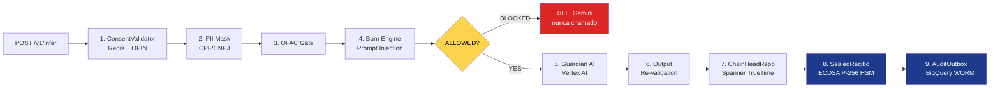

<div align="center">

  

  <br />

  <p>
    <em>Compliance is no longer a process. It is a cryptographic event.</em>
  </p>

  <br />

  
  
  
  

  <br />

  
  
  
  
  

  <br />

  
  
  

  <br />
  <br />

  <h3>The infrastructure regulated AI runs on — when the regulator is watching.</h3>

</div>

-----

## **Quem somos**

A **FoundLab** é uma empresa brasileira de *deep tech* que constrói a **Auditable Trust Infrastructure (ATI)** — a primeira camada programável de confiança auditável do mundo.

Não somos uma RegTech. Não somos um SaaS de compliance. Somos a **Layer 0** sobre a qual instituições financeiras Tier 1 rodam IA generativa sem violar BCB 538/2025, LGPD, DORA ou EU AI Act — todos ao mesmo tempo, sem trade-off.

> **Tese:** Compliance deixou de ser processo humano. Vira evento matemático.
> **Trust by Physics.**

-----

## **O Problema: Retention Paradox**

Toda instituição financeira regulada que tenta usar IA generativa colide com um paradoxo estrutural:

|Mandato                            |Exige                                            |Conflito                    |
|-----------------------------------|-------------------------------------------------|----------------------------|
|**BACEN / SOX / BCB 538 / SR 11-7**|Retenção **imutável** de evidência por 5–10 anos |❌ vs LGPD                   |
|**LGPD / GDPR**                    |**Apagamento** sob demanda do titular            |❌ vs BACEN                  |
|**EU AI Act / DORA**               |Explicabilidade auditável de decisão automatizada|❌ vs caixa-preta de LLM     |
|**BCB 538 Art. 32**                |Direito de recurso humano sobre decisão de IA    |❌ vs orquestração assíncrona|

Compliance manual reativo não resolve isso. Logging tradicional não resolve. Nem retenção de PII em WORM resolve — viola LGPD. Nem deletar registros resolve — viola BACEN.

**A FoundLab resolve via desacoplamento criptográfico:** PII nunca toca infraestrutura, evidência selada vai para WORM, chave de cifra fica com o cliente, e a destruição da chave torna o registro **permanentemente ilegível** sem violar retenção física.

-----

## **Stack: A Tríade da Confiança**

```
┌─────────────────────────────────────────────────────────────┐
│                    UMBRELLA PLATFORM                        │
│           (Cognitive Orchestrator / Decision Factory)       │
├─────────────────────────────────────────────────────────────┤
│   REX GUARD     │   VERITAS PROTOCOL   │   GUARDIAN AI      │
│  (Enforcement)  │   (Evidence Layer)   │  (Antifragile AI)  │
├─────────────────────────────────────────────────────────────┤
│              ZERO-PERSISTENCE ARCHITECTURE                  │
│         (RAM-only inference · gVisor · CMEK)                │
└─────────────────────────────────────────────────────────────┘
```

-----

## **🛡️ REX Guard — Compliance Middleware para Open Finance**

> *Proxy fail-closed que intercepta toda chamada Gemini/Vertex AI antes e depois da inferência. Se o BCB pergunta “por que essa IA respondeu isso?”, a resposta vem assinada por HSM em sub-50ms.*

REX Guard é o **produto de prateleira da FoundLab** — a primeira instância da ATI rodando em produção sobre stack Google Cloud (`southamerica-east1`), em pilot ativo com banco Tier 1 brasileiro sob NDA.

### **Como funciona**



### **Princípios invioláveis**

|#|Princípio              |Implementação                                                                                                                        |
|-|-----------------------|-------------------------------------------------------------------------------------------------------------------------------------|
|1|**Fail-closed**        |Qualquer falha de KMS / Spanner / BigQuery / Redis → `BLOCKED`. Zero `ALLOWED` silencioso.                                           |
|2|**Zero-persistence**   |PII processada exclusivamente em RAM. `shredBuffer()` + `requestGC()` após cada inferência. Node rodando com `--expose-gc`.          |
|3|**TrueTime**           |Timestamps de auditoria vêm exclusivamente do *commit timestamp* do Cloud Spanner. `new Date()` é **proibido** em paths de auditoria.|
|4|**PII em logs = crime**|Logger Pino com redaction de `cpf`, `cnpj`, `email`, `nome`, `account_summary`.                                                      |
|5|**Assinatura raw**     |ECDSA P-256 raw `r||s` (128 hex chars). DER é proibido.                                                                              |
|6|**Scope fail-closed**  |Payload type desconhecido → `SCOPE_MISMATCH`. Allow-by-default não existe.                                                           |

### **Especificações de produção**

|Métrica                 |Valor                                                           |
|------------------------|----------------------------------------------------------------|
|Stack backend           |Node.js 22 + TypeScript strict + Fastify 4                      |
|Stack frontend          |Next.js 15 + React 19                                           |
|Latência P99 (sealing)  |**< 50ms**                                                      |
|Cobertura de testes     |**95.97% statements · 74.15% branches** (184 testes · 15 suites)|
|Custódia de chaves      |Cloud KMS HSM (ECDSA P-256 + AES-256-GCM)                       |
|Ledger imutável         |BigQuery WORM particionado + `deletion_protection`              |
|Estado de auditoria     |Cloud Spanner (TrueTime + atomic ChainHead TX)                  |
|Cache de consentimento  |Memorystore (Redis) com TTL 60s                                 |
|Isolamento de inferência|Cloud Run + GKE Sandbox (gVisor)                                |

-----

## **📜 Veritas Protocol — Evidence Layer**

O motor de evidência criptográfica que torna toda decisão de IA **auditável sem revelar PII**.

- **Decision Evidence Object (DEO)** — emitido a cada inferência, contendo hash do input, hash do output, scope do consentimento, decisão dos gates, e o `decision_id`.
- **SealedRecibo** — DEO selado como Verifiable Credential (W3C VC), assinado em HSM via ECDSA P-256 raw.
- **Merkle Chain Notarization** — `ChainHead` atômico em Spanner liga cada recibo ao `prev_hash`, criando uma cadeia tamper-evident verificável offline.
- **Daily RFC 3161 Notarization** — raiz Merkle diária ancorada em Time Stamp Authority externa (pendente integração TSA staging).
- **Crypto-Shredding** — cliente detém a CMEK no Cloud KMS. Destruir a chave → registro WORM torna-se permanentemente ilegível → LGPD satisfeita sem violar retenção SOX/BACEN.

> **O contrato:** *“PII Nunca Toca a Infraestrutura. A prova fica. O dado some.”*

-----

## **🌐 Umbrella Platform — Cognitive Orchestrator**

A *Decision Factory* que envolve IA **probabilística** com auditoria **determinística**.

- **Multi-engine routing** — roteia entre Google Gemini (raciocínio abstrato) e NVIDIA NIMs (inferência de baixa latência) baseado em SLO da chamada.
- **Institutional RAG** — ancoragem em fontes internas vetadas, mitigando alucinação e bloqueando exfiltração para modelos públicos.
- **Stateless serverless** — Cloud Run / GKE Autopilot, escala horizontal sem estado em disco.
- **Anti-Corruption Layer** — adaptador que isola o domínio FoundLab da dívida técnica de *core banking* legacy do cliente.

📦 **Marketplace:** *FoundLab Umbrella — Dedicated Compliance Enclave for Financial Services*

-----

## **🧠 Guardian AI — Antifragile Loop**

Inteligência que aprende com correção humana sem virar caixa-preta.

- **Critic-Loop** — toda intervenção humana (BCB 538 Art. 32 — direito de recurso) vira sinal de treinamento de alto valor.
- **AppealService** — implementa o fluxo formal de contestação de decisão automatizada com SLA regulatório.
- **Human-in-the-Loop estruturado** — decisões de alto impacto roteiam para revisão humana com contexto cifrado em AES-256-GCM.

-----

## **Cobertura Regulatória**

|Regulamentação                            |Mecanismo FoundLab                                          |Status                |
|------------------------------------------|------------------------------------------------------------|----------------------|
|**BCB 538/2025** (Art. 8, 12, 32)         |Pipeline fail-closed + AppealService + audit trail HSM-bound|✅ Enforced em produção|
|**LGPD** (Art. 18 — direito ao apagamento)|Crypto-Shredding via CMEK do cliente                        |✅ Enforced            |
|**SOX / BACEN** (retenção 5-10 anos)      |BigQuery WORM + `deletion_protection`                       |✅ Enforced            |
|**SR 11-7** (governança de modelo)        |Veritas evidence chain + DEO por decisão                    |✅ Mapped              |
|**EU AI Act** (sistemas de alto risco)    |F2F-RaaT runtime + invariantes auditáveis                   |✅ Mapped (data room)  |
|**DORA** (resiliência operacional)        |TrueTime + atomic TX + fail-closed em todas as dependências |✅ Mapped (data room)  |

-----

## **Stack & Soberania de Deploy**

Modelo padrão-ouro: **Dedicated VPC do cliente**. Sem multi-tenant. Sem dado saindo do perímetro.

|Camada                 |Tecnologia                             |Função estratégica                                                                                  |
|-----------------------|---------------------------------------|----------------------------------------------------------------------------------------------------|
|**Compute efêmero**    |Cloud Run · GKE Sandbox (gVisor)       |Execução stateless. Isola código de IA do kernel do host. Previne *container escape*.               |
|**Estado de auditoria**|Cloud Spanner (TrueTime)               |Atomic ChainHead TX + commit timestamp regulatorial.                                                |
|**Ledger imutável**    |BigQuery WORM                          |Particionado + `deletion_protection`. Append-only físico.                                           |
|**Custódia de chaves** |Cloud KMS HSM (CMEK)                   |ECDSA P-256 (sealing) + AES-256-GCM (appeals). Cliente detém a chave.                               |
|**Cache de consent**   |Memorystore (Redis)                    |TTL 60s. TLS em produção.                                                                           |
|**Perímetro de dados** |VPC Service Controls                   |Firewall arquitetural para APIs do Google. Bloqueia exfiltração mesmo com credenciais comprometidas.|
|**Conexão privada**    |Private Service Connect                |Tráfego unidirecional, não transitivo, sobre backbone Google.                                       |
|**IaC**                |Terraform · Terragrunt                 |Deploy idempotente em VPC do cliente.                                                               |
|**Inferência LLM**     |Vertex AI (Gemini) + NVIDIA NIMs       |Roteamento por SLO.                                                                                 |
|**CI/CD**              |GitHub Actions + OIDC Workload Identity|Sem service account key estática.                                                                   |

-----

## **Alpha Operacional**

Métricas operacionais em produção com **Elitte Capital** — investment office com partnership BTG Pactual / Necton, focado em UHNWI e family offices:

|Métrica              |Antes   |Depois        |Δ                            |
|---------------------|--------|--------------|-----------------------------|
|Ciclo de conformidade|21 horas|**16 minutos**|**−98,7%** (~78× mais rápido)|
|Taxa de erro humano  |42%     |**2,5%**      |**−94%**                     |
|Latência de sealing  |n/a     |**< 50ms P99**|—                            |

**Métrica North Star:** NRR ≥ **110%**. Modelo *land-and-expand* que escala com o volume de inferências auditadas.

-----

## **Parcerias Tecnológicas**

### **Google Cloud — Select Technology Partner**

A FoundLab é **Google Cloud Select – Technology Partner** e ISV no Google Cloud Marketplace. Toda a ATI é construída sobre primitivas first-party do GCP — Cloud Run, Spanner, BigQuery WORM, Cloud KMS HSM, VPC-SC, PSC, Vertex AI. Sem vendor lock-in lateral, com *deep integration* vertical sobre o stack do Google.

**Listagem oficial:** *FoundLab Umbrella – Dedicated Compliance Enclave for Financial Services* (Google Cloud Marketplace).

### **NVIDIA — Inception Program Member**

Aceleração de inferência via **NVIDIA NIMs** (NVIDIA Inference Microservices) para cargas com SLO de latência crítica. Estratégia de computação híbrida: Vertex AI (Gemini) para raciocínio abstrato, NIMs para tarefas determinísticas de alta vazão.

### **GTM Trilateral**

|Camada            |Papel                                      |
|------------------|-------------------------------------------|
|**Google Cloud**  |Plataforma + co-venda + incentivos via CUDs|
|**FoundLab** (ISV)|Produto, IP, suporte Nível 3               |
|**2RP** (Revenda) |Implementação local + suporte Nível 1/2    |

-----

## **Liderança**

|               |                                                                                                           |
|---------------|-----------------------------------------------------------------------------------------------------------|
|**Alex Bolson**|Founder & Chief Architect — visão, arquitetura, decisões técnicas                                          |
|**Raissa Melo**|CSO & Sócia Executiva — bridge institucional entre mercado financeiro tradicional e ecossistema de inovação|

-----

## **Empresa**

|                       |                                        |
|-----------------------|----------------------------------------|
|**Razão social**       |FoundLab Tecnologia Ltda.               |
|**Fundação**           |29 de Novembro de 2024                  |
|**Tamanho**            |1–10                                    |
|**Tier de parceria**   |Google Cloud Select – Technology Partner|
|**Tipo de parceiro**   |ISV / Technology Partner                |
|**Produtos suportados**|Google Cloud Platform                   |
|**Idiomas**            |Português · Inglês                      |
|**Países atendidos**   |Brasil                                  |

### **Sedes**

**Sede Balneário Camboriú**
Rua 1500, 820 · Floor 2002 · Balneário Camboriú · SC · 88330-528 · BR
+55 48 3031-8700

**Escritório Florianópolis**
Av. Rio Branco, 404 · Torre II · Sala 1203 · Florianópolis · SC · 88015-200 · BR
+55 48 3031-8700

### **Contato**

📩 [contato@foundlab.com.br](mailto:contato@foundlab.com.br)
🌐 [foundlab.com.br](https://foundlab.com.br)

-----

## **Repositórios**

Os repositórios desta organização são predominantemente **privados** — código regulatório sob NDA bancário e propriedade intelectual sujeita a contrato.

Para acesso técnico, *data room*, demonstrações de produto, ou material de avaliação institucional: `contato@foundlab.com.br`.

-----

## **Licenciamento**

Propriedade intelectual da FoundLab — Veritas Protocol, REX Guard, Umbrella Platform, F2F-RaaT runtime — é proprietária. Componentes específicos são disponibilizados sob licença comercial via Google Cloud Marketplace ou contrato direto.

Componentes open-source de suporte, quando publicados, seguem licenças permissivas individuais sinalizadas por repositório.

-----

<div align="center">

<br />

<sub><strong>FoundLab Tecnologia Ltda.</strong> · Balneário Camboriú · Florianópolis · Brasil</sub>
<br />
<sub><em>Building the trust layer regulated AI runs on.</em></sub>

<br />
<br />


</div>
